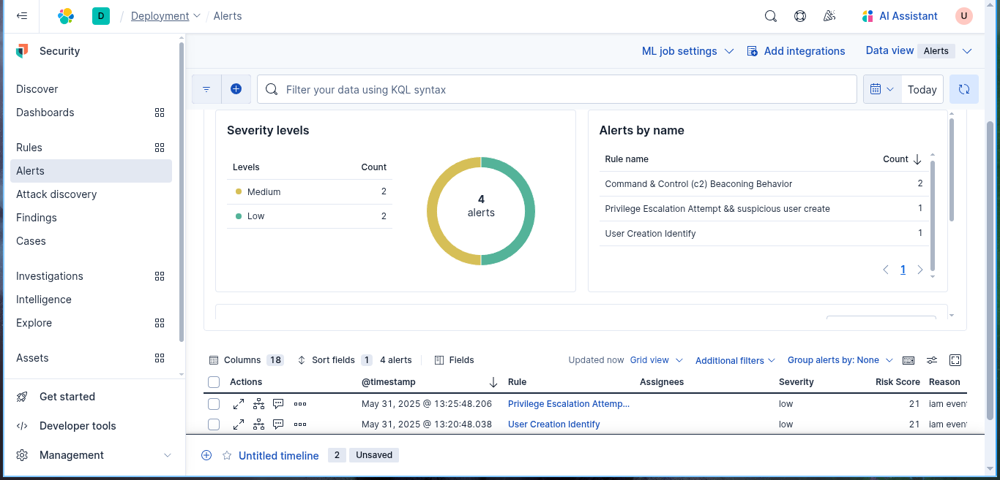

# Privilege Escalation Attempt

##  Scenario Description

  An attacker, already inside a **compromised Windows system**, attempts to **escalate privileges** by performing various enumeration and exploitation activities. Common post-exploitation behavior includes running commands like:
  
-  `whoami /priv` – to view enabled privileges
- `net localgroup administrators` – to check/admin user access
- `icacls` and `takeown` – to inspect or modify file permissions
- `wmic service list full` – to enumerate services for abuse
- Searching for **unquoted service paths**, **alwaysInstallElevated** registry keys, or **misconfigured scheduled tasks**
- Abusing tools like `PowerUp.ps1` or `SharpUp.exe` for automated privilege escalation checks
These actions are typical during **local enumeration and privilege escalation attempts** in Windows environments.

## Objective
  To **detect and alert** on suspicious behavior indicative of **privilege escalation attempts** on Windows endpoints. The goal is to identify adversarial techniques such as privilege enumeration, exploitation of misconfigurations, and the use of built-in tools or scripts (e.g., PowerShell, WMIC, reg.exe) that may signal an attacker trying to gain higher privileges during post-exploitation.

## Windows Event IDs

| Event ID | Description                                                                                                                                       |
| -------- | ------------------------------------------------------------------------------------------------------------------------------------------------- |
| 4720     | [A user account  created](https://www.ultimatewindowssecurity.com/securitylog/encyclopedia/event.aspx?eventid=4720)                               |
| 4728     | [A member was added to a security-enabled global group](https://www.ultimatewindowssecurity.com/securitylog/encyclopedia/event.aspx?eventid=4728) |
| 4672     | [Special privileges assigned to new logon](https://www.ultimatewindowssecurity.com/securitylog/encyclopedia/event.aspx?eventid=4672)              |

## Detection Logic / Query

```sh
event.code : ("4720" or "4728" or "4672") and
(
  winlog.event_data.TargetUserName : ("Administrators" or "Domain Admins") or
  winlog.event_data.Privileges : ("SeDebugPrivilege" or "SeTcbPrivilege" or "SeBackupPrivilege") or
  winlog.event_data.SubjectUserName : ("*")
)
```

## Sample Alert Screenshot



## Logs or Sample Event

```powershell
timestamp,event_id,command_line,image,user,destination_ip
2025-05-31T13:23:45.573Z,1,"net localgroup administrators backdoor /add",C:\\Windows\\System32\\net.exe,backdoor,172.31.32.205
```
## Detection Status

 - **4720**: Detects user account creation (possible rogue user)
- **4728**: Detects user added to a privileged group
- **4672**: Detects logons with **high-privilege rights** (often during or after escalation)