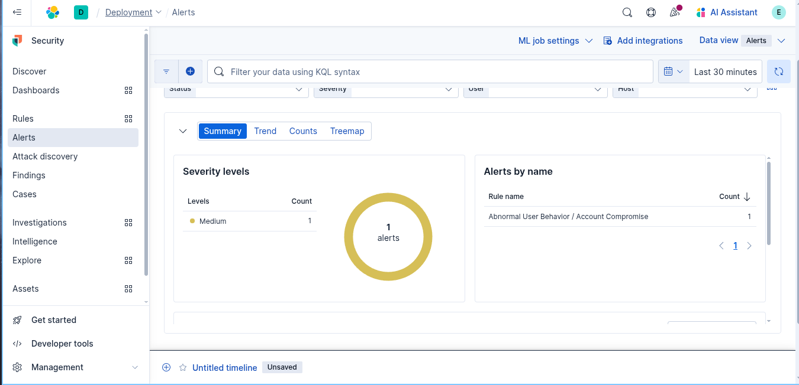

# Abnormal User Behavior / Account Compromise
##  Scenario Description
 An attacker with valid credentials gains access to the network during off-business hours (e.g., midnight–6 AM), accesses file shares, and **copies over 100 files rapidly**. This behavior is anomalous for most users and strongly indicates account compromise or malicious insider activity.
## Objective
  Detect a compromised account that:

1. Logs in during **off-hours**
2. Admin Tools Accessed
2. Copies/downloads a large number of files in a short time frame (e.g., 100+ in 5 minutes)
## Windows Event IDs

| Event ID | Description                                                                                                                |
| -------- | -------------------------------------------------------------------------------------------------------------------------- |
| 4688     | [A new process has been created](https://www.ultimatewindowssecurity.com/securitylog/encyclopedia/event.aspx?eventid=4688) |


## Detection Logic / Query

```sh
event.code: "4688" and (process.name: "mmc.exe" or process.name : "lsass.exe" or process.name: "*compmgmt.msc")
```

## Sample Alert Screenshot


## Logs or Sample Event

```powershell
@timestamp,event.code,event.provider,SourceImage,TargetImage,GrantedAccess,CallTrace,SourceProcessGUID,TargetProcessGUID,TargetProcessId,SourceProcessId,process.name,process.executable,host.name,user.name
2025-05-31T08:15:32.000Z,10,Microsoft-Windows-Sysmon,C:\Windows\System32\rundll32.exe,C:\Windows\System32\lsass.exe,0x1410,C:\Windows\System32\KERNEL32.DLL+0x1b2d,{acb1234e-1111-0000-1111-abcdef000001},{acb1234e-2222-0000-2222-abcdef000002},468,5320,rundll32.exe,C:\Windows\System32\rundll32.exe,EC2AMAZ-DNAD815,"ec2amaz-dnad815\administrator"
```
## Detection Status

 **Rule Implemented**  
 • Sysmon Event ID 10 (`ProcessAccess`) targeting `TargetImage: "C:\\Windows\\System32\\lsass.exe"` with `GrantedAccess` indicating credential-dumping rights (e.g., `0x1410`).  
• Elastic Security rule triggers when any process (e.g., `rundll32.exe`, `mimikatz.exe`) requests elevated access to `lsass.exe`
