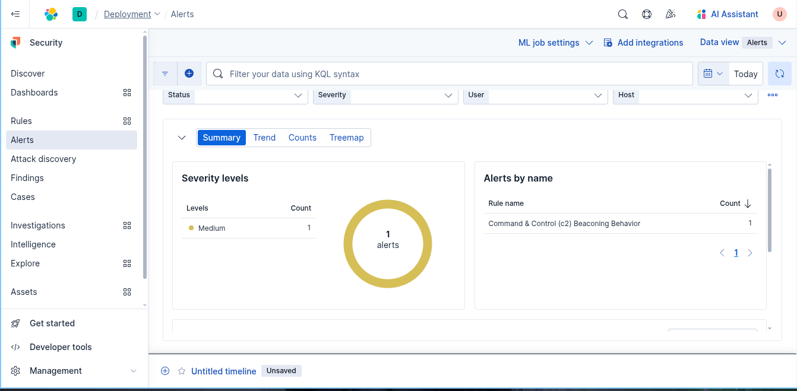

# Command & Control (c2) Beaconing Behavior

##  Scenario Description
  An attacker establishes a Command & Control (C2) channel with a compromised host using HTTP-based tools like `curl`, `http-ping`, or custom beaconing malware. The communication occurs repeatedly (e.g., every 60 seconds), usually targeting the **same destination IP** or domain. This behavior is stealthy and designed to bypass standard detection by mimicking legitimate traffic.
## Objective
  Detect periodic outbound connections (especially HTTP) from endpoints to the **same IP/domain** at **regular intervals**, which may indicate beaconing behavior used in remote access trojans (RATs) or C2 implants.
## Windows Event IDs
| Event ID | Description                                         |
| -------- | --------------------------------------------------- |
| 1        | Process creation (e.g., curl.exe, powershell.exe)   |
| 3        | Network connection initiated (destination IP, port) |

## Detection Logic / Query

```sh
event.code: "3" and 
destination.ip != null and 
destination.port: (80 or 443) and 
timestamp >= now() - 15m
```

## Sample Alert Screenshot



## Logs or Sample Event

```powershell
event_id,image,source_ip,destination_ip,destination_port,protocol,timestamp
3,C:\Windows\System32\curl.exe,172.31.32.205,10.0.0.100,443,tcp,2025-05-30T02:01:00Z
```


## Detection Status

-  Lab-tested with simulated curl + http-ping activity every 60 seconds
-  Correlation tested with destination repetition + time interval
-  Requires tuning in production to reduce false positives from legitimate cron jobs or health checks